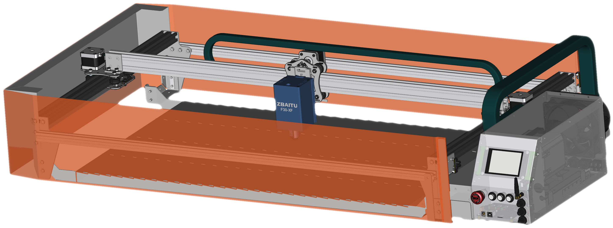
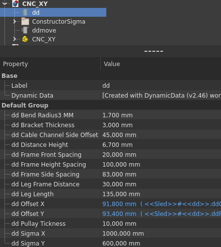
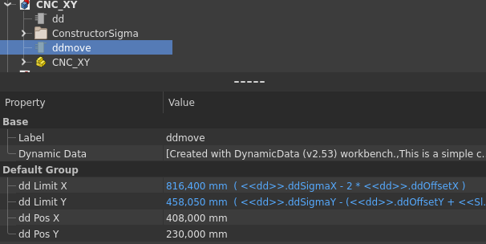
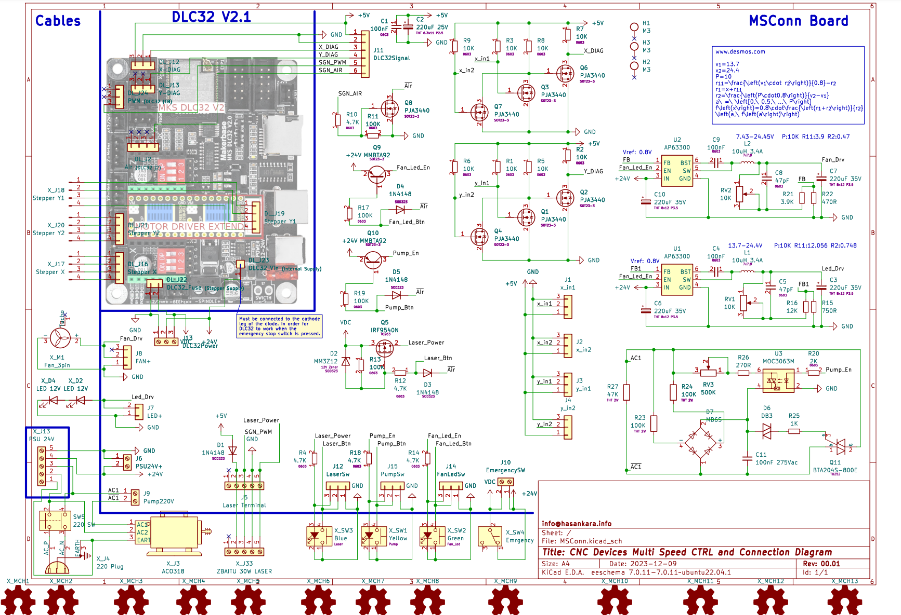
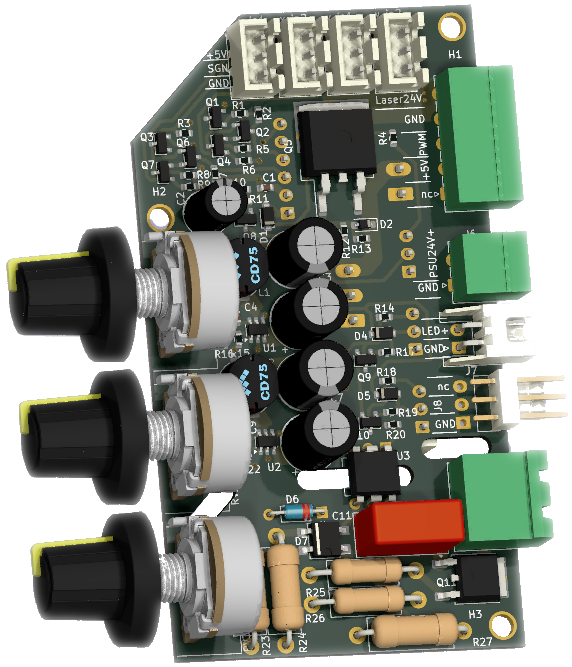
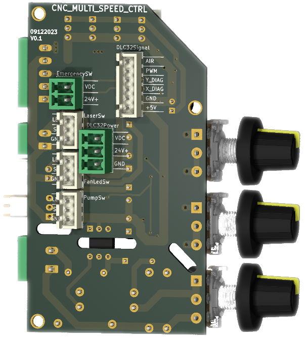

# CNC_XY_Integrated_Ventilation
Diyot lazer uyumlu, bütünleşik havalandırmalı, iki eksen cnc.

    

Highlights:
1. Çalışması için, ihtiyaç duyduğu tüm materyalleri bütün olarak üzerinde barındırması,
2. Üzerinde bütünleşik bulunan ızgara ile, hava akımı yönlendirilmesi yanısıra, bal peteği ihtiyacının karşılanması,
3. Parça aydınlatma şiddeti, Havalandırma akış hızı, kompresör hava akış hız kontrolcüleri bulunması,
4. Tüm elektronik kontrolcülerin manuel ve ayrık yönetilmesi yanısıra, operasyonla birlikte de otomatik olarak bütünleşik çalışabilmesi,
5. Standart çalışma masası üzerinde, güç soketi ve havalandırma borusu takılmasına takriben kullanıma hazır olması,
6. Üretime uygunluğu ve mekanik dayanımı

Mekanik tasarımlar için FreeCad, Elektronik tasarımlar için ise Kicad, tamamen ücretsiz tasarım programları kullanılarak gerçekleştirildi.

    
    

CNC Mekanik boyutlar CNC_XY.FCStd dosyası ana sekmede dd (dynamic data) içerisinde ddSigmaX ve ddSigmaY değişkenleri üzerinden güncellenebilmektedir.
Bu değişkenler tasarımda bulunan x ve y eksenlerinde ki sigma profillerin birebir boylarına eştir. Sigma boylarına bağlı olan tüm parçalar otomatik güncellenecektir.
Bu durumda dikkat edilmesi gereken husus, büküm yapılacak metal parçalarda değişiklik meydana geldiğinge, üretime ilişkin  lazer kesim ve büküm rehberleri,
"./pr_.." dosyaları da ayrıca açılarak el ile güncellenmelidir. 3 boyutlu parçanın lazer kesime ve büküm rehberine uygunluğu için, 
yeniden "unfold" işlemi gerçekleştirilir. Yeniden meydana gelen kesim ve büküm eskiz'leri ilgili parçanın alanına sürüklenir. 
Teknik çizim dosyalarında, view sekmeleri içerisinde, ilişik olduğu eskiz ler, XSource properties üzerinden kesim ve büküm sıralaması ile güncellenir. 
Eski kesim ve büküm eskizleri silinebilir. Bazı durumda teknik çizimde ki ölçü belirteçleri de yeniden belirtilmesi gerekebilmektedir.

ddmove değişkenleri ile lazer hareket ettirilebilir. Sigma boyları ve diğer parametreler değerlendirilerek çalışma alanı otomatik hesaplanır, 
sonuç değerleri ddLimitX ddLimitY parametrelerinde görülür.

    

Elektriksel bağlantılar, Diyagram takip edilerek gerçekleştirilebilir. Diyagram MSConn board içerisinde tasarlandı, bu sayede kicad projesi üzerinden detaylı incelenebilir.

    
    

Üretim için öncelikle BOM dosyası incelenebilir.
Satın alınması gerekli materyallerin, satın alma linkleri ve yaklaşık fiyatlandırmaları Dolar cinsinde görülebilir.
1. sayfada genel toplam ve alt sayfaların sonuç fiyatlandırmaları görülmektedir.
2. sayfada Aygıt kutusu içerisinde kullanılan satın alınması gerekli parçalar görülmektedir.
3. sayfada satın alınması gerekli mekanik parçalar görülmektedir.
4. sayfada Projeye özgün metal parçaların üretilmesi için metal kesim, metal büküm listesi görülmektedir. 
    Dosya isimlerinden, metal kesimde kullanılacak materyalin cinsi ve kalınlığı anlaşılmaktadır.
    İhtiyaç duyulan kesim dosyaları, büküm rehberleri ve diş açma rehberleri "./Mechanic_60x100/Production_.." klasörlerinde bulunabilir.
5. sayfada "Multi Speed Controller and Connections" kartının üretiminde kullanılacak elektronik komponentlerin listesi bulunmaktadır.
    PCB üretiminde ihtiyaç duyulacak gerber dosyası "./HW/MSConn/FabOut_MSConn.zip" bulunabilir. 
    PCB Prototiplemede kullanılmak üzere detaylı MSConn bom listesi "./HW/MSConn/bom/ibom_MSConn.html"bulunabilir.
    Kart üzerinde konnektör pin isimleri anlamları ile birlikte yazmaktadır.

"./Mechanic_60x100/Media/" içerisinde ilk prototip montajına ilişkin fotoğraflar yer almaktadır. İlk prototip montaj esnasında,
görülen eksiklikler doğrultusunda, mekanik ve donanım tasarımlarında, gerekli görülen güncellemeler uygulanmıştır.
