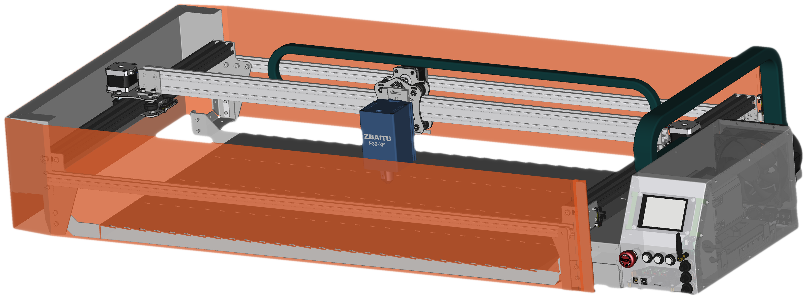
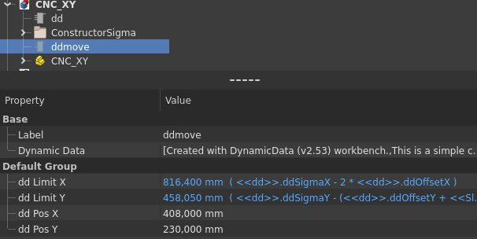

# CNC_XY_Integrated_Ventilation
Diode laser compatible, integrated ventilation, two axis cnc.

    

Highlights:
1. It contains all the materials it needs to work,
2. In addition to directing the air flow with its integrated grill, it also meets the honeycomb need,
3. Part lighting intensity, ventilation flow speed, compressor air flow speed controllers,
4. In addition to manual and separate management of all electronic controllers, they can also work automatically and integrated with the operation,
5. It is ready for use on a standard work table, after the socket and ventilation pipe are installed,
6. Suitability for production and mechanical strength are prominent features.

Completely free design programs were used during the design process. FreeCad applications were preferred for Mechanics and Kicad applications for Electronics.

    
    

CNC Mechanical dimensions CNC_XY.FCStd file can be updated via ddSigmaX and ddSigmaY variables in dd (dynamic data) on the main tab.
These variables are equivalent to the exact lengths of the sigma profiles on the x and y axes in the design. 
All parts connected to Sigma sizes will be updated automatically.
"./pr_.." files must also be opened and updated manually. For the 3D part to be suitable for laser cutting and bending guide,
The "unfold" process is performed again. The resulting cut and bend sketches are dragged into the area of the relevant part.
In technical drawing files, within the view tabs, the attached sketches are updated with the cutting and bending order via XSource properties.
Old cutting and bending sketches can be deleted. In some cases, the measurement indicators in the technical drawing may need to be re-specified.

The laser can be moved with ddmove variables. The working area is automatically calculated by evaluating sigma lengths and other parameters,
The result values are seen in the ddLimitX ddLimitY parameters.

    

Electrical connections can be made by following the Diagram. The diagram was designed within the MSConn board, it can be examined in detail through the kicad project.

    
    

For production, the BOM file can be examined first.
Purchase links and approximate prices of the materials required to be purchased can be viewed in Dollars.
1. The 1st page shows the overall total and result pricing of the sub-pages.
2. On the 2nd page, the parts that need to be purchased used in the device box are shown.
3. The mechanical parts that need to be purchased are shown on page 3.
4. On page 4, you can see the metal cutting and metal bending list for the production of metal parts unique to the project.
    The file names indicate the type and thickness of the material to be used in metal laser cutting.
    The required cutting files, bending guides and threading guides can be found in the "./Mechanic_60x100/Production_.." folders.
5. On page 5, there is a list of electronic components to be used in the production of the "Multi Speed Controller and Connections" card.
    The gerber file needed for PCB production can be found "./HW/MSConn/FabOut_MSConn.zip".
    Detailed MSConn card bom list can be found in the "./HW/MSConn/bom/ibom_MSConn.html" folder.
    The connector pin names and their meanings are written on the card. In this way, cable installation becomes more understandable.

In "./Mechanic_60x100/Media/" there are photos of the first prototype assembly. During the assembly of the first prototype,
In line with the deficiencies observed, necessary updates were applied to the mechanical and hardware designs.

